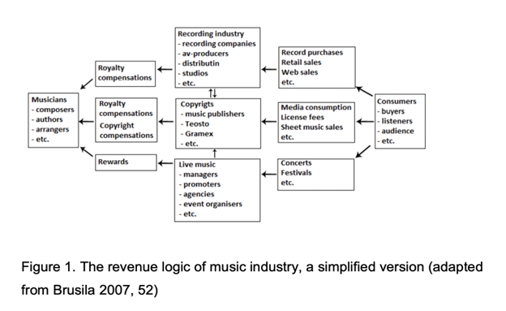

# The Music Merchandising market

As record sales have declined in the age of music streaming, the value of strong merchandising for musicians and artists has only increased. In 2019, just before the pandemic, the UK metal-core group “While She Sleeps” made headlines worldwide by releasing merchandise that explicitly aired their frustrations with streaming royalties. The shirt in question reads, “One t-shirt is the equivalent to 5000 streams on Spotify. Band merchandise is the most direct way of supporting an artist.”.

With streaming music replacing physical media sales, merchandise sales matter more than ever. An artist who is capable of moving huge volumes of merchandising can turn industry heads faster than an artist with a viral single because executives know merchandise sales are where the most money is being made.

Merchandising is growing its significance in income generation. Music will be a part of a larger media experience, for instance, music is playing a more significant role in games and movies than before. The industry is moving toward entrepreneurship, and companies are not ready to invest in new artists. Music will be utilized in different ways, such as parts of a product or part of marketing strategies.

Music merchandisers who consistently design high-quality, on-trend artwork and manufacture solid products eventually build up large rosters of clients.

## A fragmented and juicy market

Traditionally, the music industry has consisted of a few major and global record companies and a large number of smaller independent and national record companies.

Since 1999, the structure of the music business has been changing along with the developments in technology and markets. The Internet has altered the music business from producing to distributing music and it has also changed the consumption of music. One of the structural changes in the music industry was the decreasing physical sales when the consumption of music shifted to online media.

Nowadays, an artist does not necessarily need a record label as much as earlier because the developing technology decreases production and distribution costs. For artists, it is easier to take the charge of producing their music also at the beginning of their career.

## The fans and independent musicians are the leftovers

Record labels and music merchandise companies are working together to continue this tremendous growth. The days of artists releasing an album with a couple of T-shirts for sale are over. The artists and companies are coming up with creative ways to release merchandise.

In the changing music industry, the core is in a change from production-centered thinking to service-oriented thinking. The value of music is changing from owning a physical recording to connecting with the artist.

The music industry will focus on creating interest and enriching the music experience. This turning point in the industry will create new operational models, and some of the old players will have to adapt to new roles. The music industry will become shattered and change is unavoidable.

A popular music brand identity consists of four dimensions: an organizational and musical identity, an external brand identity, a discursive elaboration, and a feedback process.

An artist brand is a marketing concept that supports the 360-degree record deal, where record companies are seeking profits from all business activities connected to the artist. This includes live performances, music publishing, and music merchandising.

As technologies, such as blockchain and NFTs, grow within the music industry, record companies are turning to service providers to support their needs. Musicians are also becoming more independent and are expected to represent 1/3 of the global music market by 2030, which means that the demand for merchandising and promotional services in this market will increase significantly.

## TILT Music: a game changer

With the evolution of music consumption modes, the needs of artists have changed. Creators are now more independent in the production of their albums, with the development of home studios and technological means, but also more in interaction with their fans, through social networks. 

The counterpart of this revolution is that artists no longer generate the majority of their income from album sales, but from all other products: touring, merchandising, and now NFTs. The need of the creator is thus not so much in advances for the realization of his albums, but on the construction of his career at 360 degrees. To tour, develop merchandising products, or create NFTs, a creator needs to partner with other creators, interact with their community in the most direct way possible, and have a robust online presence.

Music has always gone beyond the boundaries of sound, representing an identity, a community, an image, and a personality. A creator's success relies on his fans. It is to develop all these success vectors with and for the artists that Tilt was founded.

